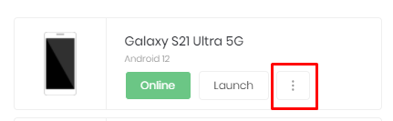
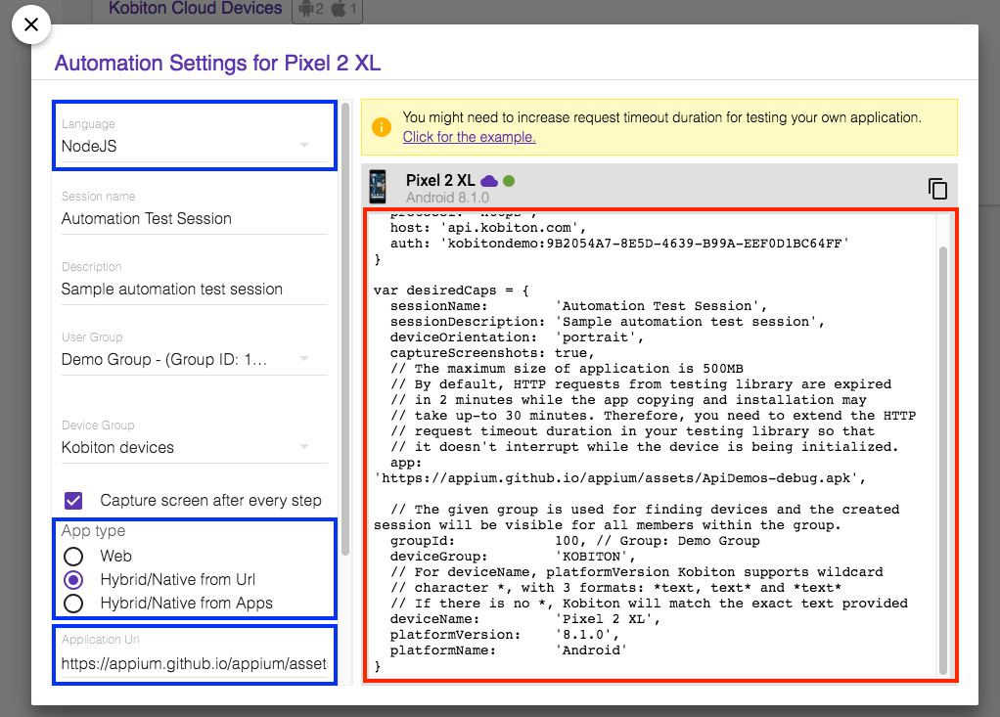
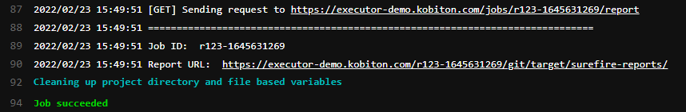

# Integrating Kobiton into GitLab mobile application development pipeline

## Table of contents

- [Integrating Kobiton into GitLab mobile application development pipeline](#integrating-kobiton-into-gitlab-mobile-application-development-pipeline)
  - [Table of contents](#table-of-contents)
  - [A. Integrating Kobiton with GitLab](#a-integrating-kobiton-with-gitlab)
    - [1. Preparation](#1-preparation)
      - [1.1. Getting Kobiton Username and API key](#11-getting-kobiton-username-and-api-key)
      - [1.2. Samples](#12-samples)
    - [2. Setup](#2-setup)
      - [2.1. Getting started](#21-getting-started)
      - [2.2. Setting Kobiton Username and API key](#22-setting-kobiton-username-and-api-key)
      - [2.3. Setting Kobiton device desired capabilities](#23-setting-kobiton-device-desired-capabilities)
      - [2.4. GitLab configuration file](#24-gitlab-configuration-file)
    - [3. Automation Test Execution](#3-automation-test-execution)
  - [B. Test session details](#b-test-session-details)
    - [1. Viewing test session details on Kobiton website](#1-viewing-test-session-details-on-kobiton-website)
    - [2. Fetching test session details using Kobiton REST API](#2-fetching-test-session-details-using-kobiton-rest-api)
  - [C. More integration](#c-more-integration)
    - [1. Execute test in another way with more custom environment variables](#1-execute-test-in-another-way-with-more-custom-environment-variables)
      - [1.1. Custom environment variables for test execution](#11-custom-environment-variables-for-test-execution)
      - [1.2. Configuration file for test execution](#12-configuration-file-for-test-execution)
      - [1.3. Executing test result](#13-executing-test-result)
    - [2. Upload app to Kobiton App Repo](#2-upload-app-to-kobiton-app-repo)
      - [2.1. Custom environment variables for uploading app](#21-custom-environment-variables-for-uploading-app)
      - [2.2. Configuration file for uploading app](#22-configuration-file-for-uploading-app)
      - [2.3. App uploading result](#23-app-uploading-result)
  - [D. Feedback](#d-feedback)

## A. Integrating Kobiton with GitLab

### 1. Preparation

#### 1.1. Getting Kobiton Username and API key

Kobiton Username and API key are required for authenticating with Kobiton API.

> If you don't have a Kobiton account, visit https://portal.kobiton.com/register to create one.

To get your Kobiton Username and API Key, follow instructions at `IV. Configure Test Script for Kobiton` section on [our blog](https://kobiton.com/blog/tutorial/parallel-testing-selenium-webdriver/).

#### 1.2. Samples

To give you an in-depth demonstration of the integration flow, we have provided samples:

- Script (written in NodeJS) for executing automation test on Kobiton devices : [automation-test-script.js](/samples/automation-test-nodejs/automation-test-script.js).
- Script (written in Bash) for uploading app to Kobiton App Repo : [upload.sh](/samples/upload-app/upload.sh).
- A collection of apps (written in Go) for executing test with a variety of custom environment variables: [packaged apps](/samples/execute-test/app-to-run).
- GitLab configuration file : [.gitlab-ci.yml](/.gitlab-ci.yml).

You can check out the sample content or keep reading because they are used in below steps as well.

### 2. Setup

#### 2.1. Getting started

Follow steps below to get started:

If you are not using [GitLab Premium](https://about.gitlab.com/pricing/premium/), you can only perform the full flow of CI/CD integration for internal repos of GitLab
1. Create a repository on GitLab and copy the content of this repository to it.
2. Ensure runners are available in your GitLab account.
   > Refer to [GitLab Documentation](https://docs.gitlab.com/ee/ci/quick_start/) for instructions on how to get everything set up.

If you want to connect GitLab CI/CD to external services (GitHub, Bitbucket) for advanced use, consider upgrading to [GitLab Premium](https://about.gitlab.com/pricing/premium/). Then you can fork this repository and select *Run CI/CD for external repository* option in GitLab and pick it up.

  > Note : At first synchronization, the build process will be failed because we haven't done any configuration for environment variables. This is normal, just ignore the failed pipeline.

#### 2.2. Setting Kobiton Username and API key

In your project Settings > CI/CD > Variables in GitLab, add two environment variables with Flag `Mask variable` option checked :

- `KOBI_USERNAME` : Your Kobiton's username.
- `KOBI_API_KEY` : Your Kobiton's API Key.

Your `Environment Variables` window should look like this


#### 2.3. Setting Kobiton device desired capabilities

In order to execute tests on a specific device in Kobiton, its corresponding desired capabilities needs to be supplied.

The provided automation testing script has been pre-configured to execute automation test of a demo Android application on a random, available Android devices.

**Demo application details**

```
- Filename: ApiDemos-debug.apk
- Download link: https://appium.github.io/appium/assets/ApiDemos-debug.apk
```

If you want to execute on a specific device, refer to instructions below to get the corresponding desired capabilities for that device.

**Setting up desired capabilities**

1. Go to https://portal.kobiton.com/login and login with your Kobiton account.
2. Click **"Devices"** icon in the sidebar on the left.

3. For the device you want to execute on, click the three dot button. Then click *Automation Settings* button.




4. In the `Automation Settings` popup:

- In `Language` section, choose `NodeJS`.
- In `App Type` section, choose `Hybrid/Native from Url`.
- In `Application Url` section, put `https://appium.github.io/appium/assets/ApiDemos-debug.apk`.



5. From the collected desired capabilities, add these environment variables with corresponding values to your project Settings > CI/CD > Variables in GitLab as shown in the table below

| GitLab Environment Variable         | Desired Capabilities Variable | Description                                         | Examples                                             |
| ----------------------------------- | ----------------------------- | --------------------------------------------------- | --------------------------------------------------------- |
| KOBITON_DEVICE_PLATFORM_NAME        | platformName                  | Kobiton Device Platform Name (e.g: Android, iOS)    | Android                                                   |
| KOBITON_DEVICE_NAME                 | deviceName                    | Kobiton Device Name                                 | Galaxy\*                                                  |
| KOBITON_DEVICE_PLATFORM_VERSION     | platformVersion               | Kobiton Device Platform Version                     | _No_                                                      |
| KOBITON_SESSION_DEVICE_ORIENTATION  | deviceOrientation             | Device Orientation (e.g: Portrait, Landscape)       | portrait                                                  |
| KOBITON_SESSION_CAPTURE_SCREENSHOTS | captureScreenshots            | Enable screenshots capture during session execution | true                                                      |
| KOBITON_SESSION_DEVICE_GROUP        | deviceGroup                   | Kobiton device group                                | KOBITON                                                   |
| KOBITON_ORGANIZATION_GROUP_ID       | groupId                       | Group ID of the device                              | _No_                                                      |
| KOBITON_SESSION_APPLICATION_URL     | app                           | Download link to the application used for testing   | https://appium.github.io/appium/assets/ApiDemos-debug.apk |

#### 2.4. GitLab configuration file

GitLab can run on this repository since we have already provided a simple configuration file at [.gitlab-ci.yml](/.gitlab-ci.yml). Below is the brief explanation of the provided configuration file, you can skip this section if you're familiar with GitLab CI.

```yaml
automation-test-nodejs:
  cache:
    paths:
      - node_modules/
  image: node:latest
  script:
    - cd samples/automation-test-nodejs
    - npm install
    - npm run automation-test-script
```

- Here we use GitLab official latest NodeJS Docker image as the execution environment

> ```yaml
> image: node:latest
> ```

- Change working directory to the one containing automation test script

> ```yaml
> cd samples/automation-test-nodejs
> ```

- Install missing dependencies

> ```yaml
> npm install
> ```

- Execute automation test script on Kobiton

> ```yaml
> npm run automation-test-script
> ```

> For more information about how to execute automation test(s) on Kobiton, you can visit:
>
> - [Kobiton documentation](https://support.kobiton.com/hc/en-us)
> - [Kobiton sample automation test scripts in other languages](https://github.com/kobiton/samples)

### 3. Automation Test Execution

- Simply re-initiate the build process on GitLab and it will execute the automation test script on Kobiton.
- Your test execution progress can be viewed on GitLab.


- Your test execution progress can also be viewed on Kobiton


## B. Test session details

### 1. Viewing test session details on Kobiton website

Your test session can be viewed on Kobiton website. Follow these steps below

1. Go to https://portal.kobiton.com/sessions, login with your Kobiton account.
2. You will see your executed sessions and their statuses.

3. Click on any session to view its details, commands.

### 2. Fetching test session details using Kobiton REST API

Kobiton has already provided samples written in NodeJS to get session information, commands using Kobiton REST API.

Refer to [Kobiton sample for REST API](https://github.com/kobiton/samples/tree/master/kobiton-rest-api/get-session-data-and-commands) for instructions.

## C. More integration

### 1. Execute test in another way with more custom environment variables

We have packaged the process into a single app (written in Go) to run. The result may be similar to the method above, but you are able to provide us with more custom environment variables, like which executor will be used to perform or the repository of the test script, etc

#### 1.1. Custom environment variables for test execution

| GitLab Environment Variable | Required                                      | Description                                                                                                                                                                           | Examples                                                     |
| --------------------------- | --------------------------------------------- | ------------------------------------------------------------------------------------------------------------------------------------------------------------------------------------- | ------------------------------------------------------------ |
| KOBI_USERNAME               | yes                                           | The user in Kobiton                                                                                                                                                                   | _secret_                                                     |
| KOBI_API_KEY                | yes                                           | Specific key to access Kobiton API                                                                                                                                                    | _secret_                                                     |
| EXECUTOR_URL                | yes                                           | Kobiton Automation Test Executor URL to perform                                                                                                                                       | https://executor-demo.kobiton.com                            |
| EXECUTOR_USERNAME           | yes                                           | The Username for Kobiton Automation Test Executor                                                                                                                                     | _secret_                                                     |
| EXECUTOR_PASSWORD           | yes                                           | The Password Kobiton Automation Test Executor                                                                                                                                         | _secret_                                                     |
| GIT_REPO_URL                | yes                                           | Link to your Git repository                                                                                                                                                           | https://github.com/sonhmle/azure-devops-sample-java-prod.git |
| GIT_REPO_BRANCH             | yes                                           | The branch of your Git repository you want to execute automation test with                                                                                                            | master                                                       |
| GIT_REPO_SSH_KEY            | optional                                      | It is used if your Git Repository is private                                                                                                                                          | _secret_                                                     |
| APP_ID                      | optional                                      | The App ID or App URL to use in your test script                                                                                                                                      | kobiton-store:275643                                         |
| USE_CUSTOM_DEVICE           | yes                                           | Check if you want to execute one or some test cases with a specific Kobiton Cloud Device. If you already set your device information in your test script, leave this field unchecked. | true                                                      |
| DEVICE_NAME                 | optional (yes when use_custom_device is true) | Kobiton Device Name                                                                                                                                                                   | Galaxy A20s                                            |
| DEVICE_PLATFORM_VERSION     | optional (yes when use_custom_device is true) | Kobiton Device platform version                                                                                                                                                       | 10                                                        |
| DEVICE_PLATFORM             | optional (yes when use_custom_device is true) | Kobiton Device platform                                                                                                                                                               | android                                                      |
| ROOT_DIRECTORY              | yes                                           | Input the root directory of your Git repository                             |   /         |
| COMMAND                     | yes                                           | Command lines to install dependencies and execute your automation test script. These commands will run from the root directory of your Git repository                                 | mvn test                                                   |
| WAIT_FOR_EXECUTION          | yes                                           | Check if your want the release pipeline to wait until your automation testing is completed or failed, then print out the console log and test result                                  | true                                                       |
| LOG_TYPE                    | optional                                      | Your desired log type to be showed. Choose Combined to show logs in chronological order, or Separated for single type of log ("output" or "error")                                    | combined                                                   |

> Warning: You must select 'Mask variable' option for any secret value above

#### 1.2. Configuration file for test execution

```yaml
execute-test:
  script:
    - cd samples/execute-test
    - chmod u+x test.sh
    - ./test.sh
```

In the [test.sh](/samples/execute-test/test.sh) script, you can specify the app to run based on your running system. We have provided apps for 3 platforms in the [app-to-run](/samples/execute-test/app-to-run) folder (app_darwin for macOS, app_linux for Linux, app_windows for Windows)

#### 1.3. Executing test result

The test result will be shown on GitLab console with report link, and the session will be listed in Kobiton Portal as mentioned above.


### 2. Upload app to Kobiton App Repo

You can integrate this workflow into your repository with GitLab CI, which makes it really convenient for auto uploading a new app, or a new version for existing app.

#### 2.1. Custom environment variables for uploading app

| GitLab Environment Variable | Required | Description                                                                                                | Examples                         |
| --------------------------- | -------- | ---------------------------------------------------------------------------------------------------------- | -------------------------------- |
| KOBI_USERNAME               | yes      | The user in Kobiton                                                                                        | _secret_                         |
| KOBI_API_KEY                | yes      | Specific key to access Kobiton API                                                                         | _secret_                         |
| UPLOAD_APP_ID                      | optional | App ID in Kobiton - use this in case you want to upload new version of an existing app in Kobiton          | 275643                         |
| APP_ACCESS                  | yes      | You can either to make this app private or available for everyone in the organization (private vs. public) | public                           |
| APP_NAME                    | yes      | Title of the app to be built                                                                               | Android-test                     |
| APP_PATH                    | yes      | Path to the app .apk or .ipa file (should be in the same repo and relative from your current point)        | ./app-to-upload/android-test.apk |
| APP_SUFFIX                  | yes      | Type of the app to be uploaded - Android (apk) or iOS (ipa)                                                | apk                            |

> Warning: You must select 'Mask variable' option for any secret value above

#### 2.2. Configuration file for uploading app

```yaml
upload-app:
  script:
    - cd samples/upload-app
    - chmod u+x upload.sh
    - ./upload.sh
```

We have provided [upload.sh](/samples/upload-app/upload.sh) script for you to use. All uou have to do is to specify the custom environment variables as mentioned above and run the script.

#### 2.3. App uploading result

The result will be shown on GitLab console, and the app/app version will be shown in Kobiton Portal.


## D. Feedback

If you have any issue or further information, follow steps below to request Kobiton for support.

1. Go to https://portal.kobiton.com
2. In the left sidebar, click `Support` icon.
3. Click 'Submit a request' button.


3. Fill in all necessary information and click `Submit`.


